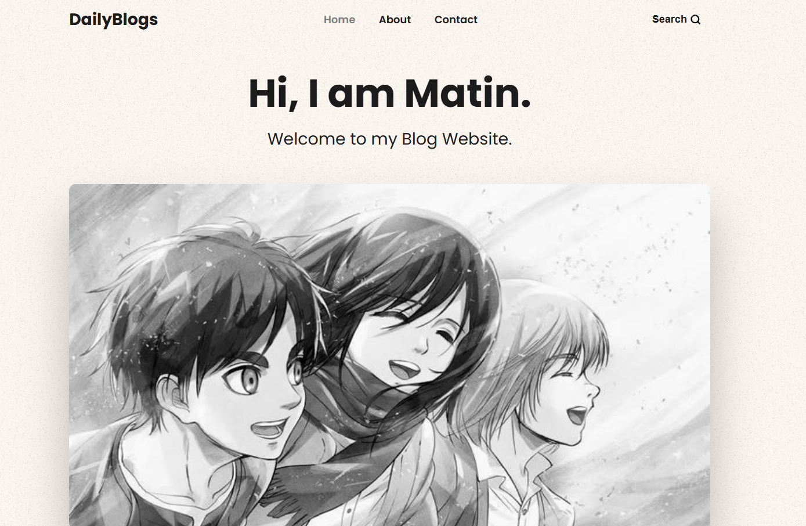
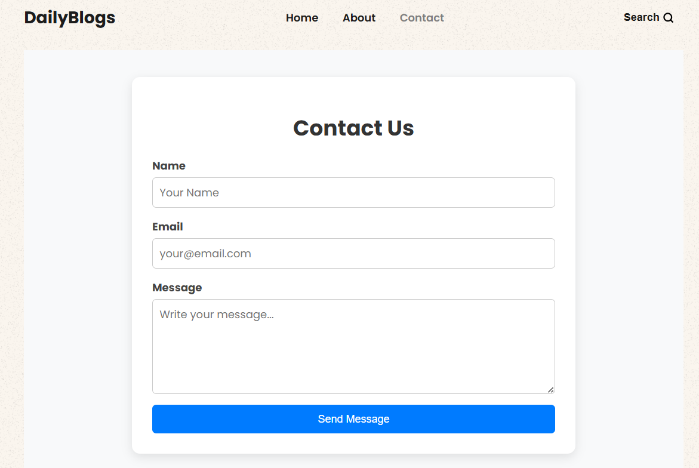
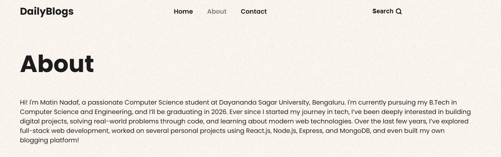

# 📝 DailyBlogs – Full Stack Blog Website

DailyBlogs is a **full-stack blogging platform** built using **Node.js, Express, MongoDB, and EJS**.  
It allows users to explore blog posts, search content, and provides a secure **admin panel** to manage blogs efficiently.

This project is built as a **portfolio project** to demonstrate real-world full-stack development skills, including authentication, CRUD operations, image handling, and cloud deployment.

---

## 🚀 Live Demo

🔗 https://dailyblogs.onrender.com  
⚠️ *Deployed on Render Free Tier – first load may take a few seconds due to cold start*

---

## 📸 Screenshots

### 🏠 Home Page


---

### 📰 Latest Posts


---

### 📖 Blog View Page


---

### 🔍 Search Results


---

### 📩 Contact Page


---

### ℹ️ About Page


---

### 🔐 Admin Login Panel


---

### 🧑‍💻 Admin Dashboard


---

### ✏️ Edit Blog Post


---

## ✨ Features

### 👤 User Features
- 📰 View latest blog posts
- 📖 Read full blog content
- 🔍 Search blogs by title
- 📩 Contact form
- 📱 Responsive UI design

### 🔐 Admin Features
- Secure admin login
- ➕ Add new blog posts
- ✏️ Edit existing posts
- 🗑️ Delete individual posts
- 🧹 Delete all posts
- 🖼️ Upload & update blog images
- 📋 Admin dashboard panel

---

## 🛠 Tech Stack

### Frontend
- HTML
- CSS
- EJS (Embedded JavaScript Templates)

### Backend
- Node.js
- Express.js

### Database
- MongoDB Atlas
- Mongoose

### Authentication
- Session-based Admin Authentication

### Deployment
- Render (Cloud Hosting)

---

## 🧠 Project Architecture Overview

- **MVC-style structure**
- Express routes for user and admin actions
- MongoDB schemas for blog posts
- Server-side rendering using EJS
- Middleware for authentication and sessions
- Environment variable handling using `.env`

---

## ⚙️ Run Project Locally

### 1️⃣ Clone the repository
```bash
git clone https://github.com/matinn07/dailyblogs-blog-website.git
cd Dailyblogs-Website
Install Dependencies
-npm install
Create .env file, login to mongodb atlas and create cluster and paste connection string
MONGO_URI=your_mongodb_atlas_connection_string
npm start

